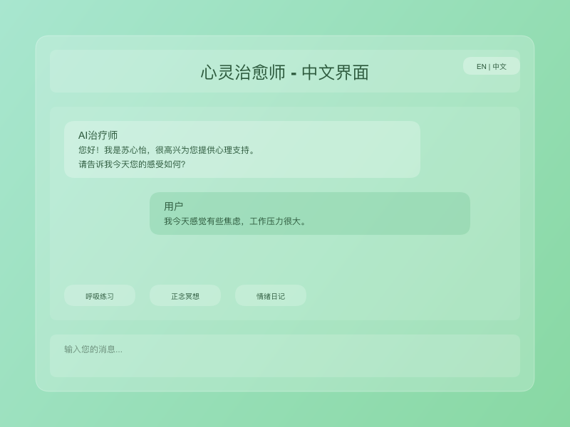
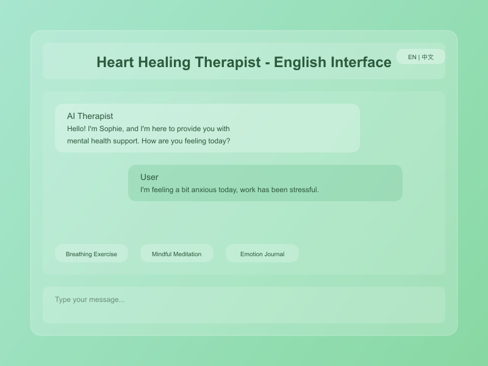

# 🌱 Heart Healing Therapist - AI-Powered Mental Health Support Platform

An intelligent psychological therapy assistant powered by Tencent's Hunyuan Large Language Model, featuring advanced glassmorphism design to provide professional, warm mental health support.

## 🖼️ Screenshots

### Bilingual Support
<div align="center">
  
  
  <p><em>Full bilingual support - Chinese and English interfaces</em></p>
</div>

### Welcome Experience
<div align="center">
  
  <p><em>Personalized onboarding with avatar selection and therapist style preferences</em></p>
</div>

## ✨ Key Features

### 🧠 Intelligent AI Therapist
- **Professional Psychology Background**: Based on Cognitive Behavioral Therapy (CBT) principles
- **Personalized Therapy Styles**: Four distinct approaches - Gentle & Caring, Professional & Rigorous, Positive & Encouraging, Wise & Experienced
- **Emotional Intelligence**: Real-time emotion detection and analysis
- **Persistent Memory System**: Remembers every conversation to build long-term therapeutic relationships

### 🎨 Advanced Glassmorphism Design
- **Transparent Green Theme**: Soothing gradient backgrounds for relaxation
- **Glass Morphism Effects**: Backdrop-filter with multi-layer transparency
- **Dynamic Light Effects**: Shimmer animations and glow effects
- **Responsive Design**: Perfect adaptation across all devices

### 👤 Personalized Experience
- **24 Avatar Options**: Expressions, characters, animals, and symbols
- **Custom User Profiles**: Personalized therapeutic experience
- **Therapist Style Adjustment**: Choose AI response style based on preferences
- **Emotion Visualization**: Real-time emotional state tracking

### 🛡️ Security & Privacy
- **Complete Confidentiality**: All conversation data stored locally
- **Security Hardening**: Helmet security middleware protection
- **Data Encryption**: Sensitive information encrypted storage
- **Privacy Protection**: No third-party data leakage

### 🌐 Bilingual Support
- **Full Chinese/English Support**: Complete localization
- **Language Switching**: Seamless language transitions
- **Cultural Adaptation**: Culturally appropriate responses
- **Professional Translation**: High-quality therapeutic terminology

## 🚀 Technology Stack

### Frontend
- **React 18**: Modern user interface
- **Vite**: Fast build tool
- **CSS3**: Advanced glassmorphism effects
- **Responsive Design**: Mobile-first approach
- **i18n**: Internationalization support

### Backend
- **Node.js + Express**: High-performance server
- **Tencent Hunyuan LLM**: Professional AI conversation capabilities
- **Persistent Memory System**: Local file storage
- **RAG Enhancement**: Retrieval-Augmented Generation

### Core Features
- **Emotion Analysis Engine**: Intelligent emotion recognition
- **Personality System**: AI humanization experience
- **Healing Activities**: Breathing exercises, mindfulness meditation
- **Crisis Detection**: Automatic risk signal identification

## 📦 Quick Start

### Prerequisites
- Node.js >= 16.0.0
- npm >= 8.0.0

### Installation

1. **Clone Repository**
```bash
git clone https://github.com/Kevin-Li-2025/AI-psychologist.git
cd AI-psychologist
```

2. **Install Dependencies**
```bash
# Install backend dependencies
npm install

# Install frontend dependencies
cd frontend
npm install
cd ..
```

3. **Environment Configuration**
```bash
# Copy environment template
cp env.example .env

# Edit .env file and add your Tencent Hunyuan API keys
nano .env
```

4. **Start Application**
```bash
# Build frontend
cd frontend && npm run build && cd ..

# Start server
npm start
```

5. **Access Application**
Open your browser and visit: `http://localhost:3001`

## 🔧 Configuration

### Environment Variables
```env
# Tencent Hunyuan API Configuration
HUNYUAN_API_KEY=your_api_key_here
HUNYUAN_SECRET_ID=your_secret_id_here
HUNYUAN_SECRET_KEY=your_secret_key_here

# Server Configuration
PORT=3001
NODE_ENV=production

# Logging Level
LOG_LEVEL=info
```

### API Key Setup
1. Visit [Tencent Cloud Console](https://console.cloud.tencent.com/)
2. Enable Hunyuan Large Model service
3. Obtain API keys and access credentials
4. Configure in .env file

## 🏗️ Project Structure

```
AI-psychologist/
├── frontend/                 # Frontend application
│   ├── src/
│   │   ├── components/       # React components
│   │   │   ├── AdvancedUI/  # Advanced UI components
│   │   │   ├── TherapyInterface.jsx
│   │   │   ├── TherapyMessage.jsx
│   │   │   ├── TherapyInput.jsx
│   │   │   ├── WelcomeScreen.jsx
│   │   │   └── HealingFeatures.jsx
│   │   ├── hooks/           # Custom hooks
│   │   │   └── useTranslation.js
│   │   ├── i18n/            # Internationalization
│   │   │   ├── index.js
│   │   │   └── locales/
│   │   │       ├── en.json
│   │   │       └── zh.json
│   │   ├── services/         # Frontend services
│   │   │   ├── hunyuanApi.js
│   │   │   ├── ragService.js
│   │   │   └── systemPrompts.js
│   │   └── App.jsx
│   ├── public/
│   └── package.json
├── server/                   # Backend services
│   ├── services/
│   │   ├── PersistentMemoryService.js
│   │   └── PersonalityService.js
│   └── utils/
│       ├── logger.js
│       └── index.js
├── data/                     # Data storage directory
├── images/                   # Screenshots and assets
├── server.js                 # Main server file
├── package.json
└── README.md
```

## 🎯 Core Features Deep Dive

### Persistent Memory System
- **Episodic Memory**: Records specific conversation events
- **Semantic Memory**: Stores concepts and knowledge
- **Emotional Memory**: Preserves emotional experiences
- **Relationship Memory**: Tracks therapeutic relationship development

### AI Personality System
- **Real Name**: Dr. Sophie (苏心怡)
- **Professional Background**: PhD in Psychology with rich clinical experience
- **Personality Traits**: Big Five personality dimensions with dynamic adjustment
- **Emotional State**: Influenced by user emotions

### Healing Features
- **Breathing Exercises**: 4-7-8 breathing technique
- **Mindfulness Meditation**: 5-minute guided practice
- **Gratitude Practice**: Positive psychology techniques
- **Emotion Journaling**: Self-exploration tools

### Bilingual Capabilities
- **Language Detection**: Automatic language identification
- **Context Preservation**: Maintains context across language switches
- **Cultural Sensitivity**: Culturally appropriate therapeutic approaches
- **Professional Terminology**: Accurate psychological terms in both languages

## 🔒 Security Features

- **Rate Limiting**: Prevents API abuse
- **Error Handling**: Global exception catching
- **Data Validation**: Input security checks
- **Logging Monitoring**: Detailed operation records
- **HTTPS Encryption**: Secure data transmission
- **CORS Protection**: Cross-origin request security

## 📱 Mobile Optimization

- **Responsive Layout**: Perfect fit for phones and tablets
- **Touch-Friendly**: Optimized interaction experience
- **Performance Optimization**: Lazy loading and code splitting
- **Offline Support**: Basic functionality available offline

## 🚨 Important Notice

**This AI assistant provides supportive conversation and cannot replace professional psychological therapy. In case of emergency, please contact immediately:**

- **Crisis Hotline**: 988 (US), 400-161-9995 (China)
- **24-Hour Mental Health Support**: Local emergency services
- **Emergency Medical Services**: 911 (US), 120 (China)

## 🤝 Contributing

1. Fork the repository
2. Create a feature branch (`git checkout -b feature/AmazingFeature`)
3. Commit your changes (`git commit -m 'Add some AmazingFeature'`)
4. Push to the branch (`git push origin feature/AmazingFeature`)
5. Open a Pull Request

### Development Guidelines
- Follow ESLint and Prettier configurations
- Write comprehensive tests
- Update documentation for new features
- Ensure bilingual support for UI changes

## 📄 License

This project is licensed under the MIT License - see the [LICENSE](LICENSE) file for details.

## 🙏 Acknowledgments

- [Tencent Hunyuan LLM](https://cloud.tencent.com/product/hunyuan) - Powerful AI conversation capabilities
- [React](https://reactjs.org/) - Excellent frontend framework
- [Express](https://expressjs.com/) - Reliable backend framework
- All contributors and users for their support

## 📞 Contact

- Project Maintainer: Kevin Li
- GitHub: [@Kevin-Li-2025](https://github.com/Kevin-Li-2025)
- Project Link: [https://github.com/Kevin-Li-2025/AI-psychologist](https://github.com/Kevin-Li-2025/AI-psychologist)

---

**💚 Let technology warm hearts, use AI to convey care 💚**

*Building with heart, healing with love*